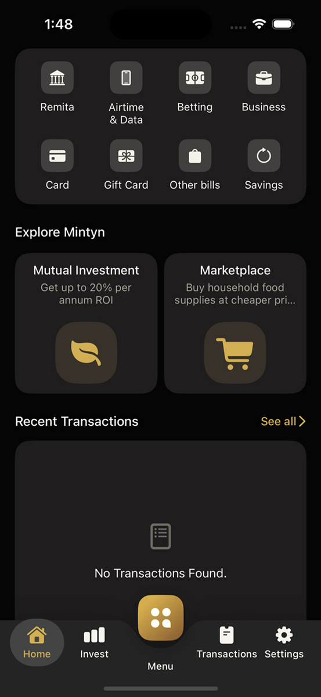

## iOS UIKit App – Mintyn-Inspired Demo

## App Walkthrough

[](media/mintyn-demo.mp4)

Recorded iPhone simulator walkthrough: [mintyn-demo.mp4](media/mintyn-demo.mp4)

The walkthrough covers:
- login quick actions
- mocked authentication
- home dashboard sections
- custom tab navigation
- settings appearance flow
- logout back to login

### 1. Project Overview

A **UIKit-based iOS application** that recreates key flows from the Mintyn app:

* **Login (mocked)**
* **Home dashboard**
* **Custom bottom navigation**
* **Placeholder authenticated tabs**

The app uses a **mock authentication flow** (no backend integration) and focuses on **UI structure, navigation, and clean architecture**. It also includes **unit and UI tests** for critical flows.

---

### 2. User Roles & Personas

#### Primary User

* **End User**

  * Logs into the app (mocked)
  * Views account/home dashboard
  * Accesses settings and app information
  * Logs out

---

### 3. System Context & Architecture

#### Architecture Style

* **UIKit + MVC/MVVM hybrid (preferred: MVVM for scalability)**
* Modular and testable design

#### Key Components

* **AppCoordinator / SceneDelegate**

  * Handles root navigation (Login → Main Tabs)
* **Authentication Layer**

  * Mock service to simulate login/logout
* **Main Tab Shell**

  * Hosts:

    * Home
    * Invest
    * Menu
    * Transactions
    * Settings

#### Folder Structure

```
/App
  /Coordinators
  /Core
    /Services (AuthService, MockData)
    /Extensions
  /Features
    /Login
    /Home
    /Settings
  /Resources
  /Tests
```

#### Navigation Flow

```
LoginViewController
   ↓ (successful mock login)
MainTabsViewController
   ├── HomeViewController
   ├── UnavailableFeatureViewController (Invest)
   ├── UnavailableFeatureViewController (Menu)
   ├── UnavailableFeatureViewController (Transactions)
   └── UnavailableFeatureViewController (Settings + Logout)
```

---

### 4. Core Features

#### 4.1 Login (Mocked)

* Input fields:

  * Email/Username
  * Password
* Validation:

  * Non-empty fields
* On login:

  * Call mock auth service
  * Navigate to Home tab

#### 4.2 Home Dashboard

* Mock state-driven dashboard reflecting:

  * Account summary
  * Transfer and add-money actions
  * Promo tiles
  * Quick access shortcuts
  * Explore cards
  * Recent-transactions empty state

#### 4.3 Authenticated Tabs

* Custom bottom navigation with:

  * Home
  * Invest
  * Menu
  * Transactions
  * Settings
* Non-home destinations currently use a shared "screen not available" placeholder.
* Settings owns the logout action and returns the user to Login.

---

### 5. Mock Login Credentials

> ⚠️ **Use any of the phone numbers below with the password to log in.**

| # | **Phone Number** | **Password** |
|---|-----------------|-------------|
| 1 | **`8021234567`** | **`password`** |
| 2 | **`8141584265`** | **`password`** |
| 3 | **`8000000000`** | **`password`** |
| 4 | **`7000000000`** | **`password`** |
| 5 | **`9000000000`** | **`password`** |

Phone numbers can be entered in any of these formats:
- `8021234567` (10 digits)
- `08021234567` (with leading 0)
- `+2348021234567` (with country code)

> These credentials are used with the mock authentication service. No real backend is involved.

---

### 6. Testing Strategy

#### Unit Tests

* `AuthService`

  * Login success/failure
  * Logout behavior
* ViewModels (if MVVM used)

  * Input validation
  * State transitions
  * Home loading, error, retry, and empty states

#### UI Tests

* Login flow:

  * Enter credentials → navigate to Home
* Tab navigation:

  * Home ↔ authenticated tab switching
* Logout flow:

  * Settings logout → return to Login screen

---

### 7. Assumptions & Constraints

* No real backend integration
* UI approximates Mintyn design (not pixel-perfect)
* Focus is on:

  * Code structure
  * Navigation
  * Testability

---

### 8. Deliverables

* Working iOS project (UIKit)
* Unit & UI tests
* `README.md` (this file)
* `SOLUTION.md` including:

  * Refactors you would implement
  * Architectural improvements
  * Performance or scalability considerations

---

### 9. Suggested Enhancements (Post-Exercise)

(To be detailed in `SOLUTION.md`)

* Dependency Injection
* Full MVVM or Clean Architecture
* Networking abstraction layer
* Persistent session handling (Keychain/UserDefaults)
* Improved UI components and reuse
* Snapshot testing for UI consistency
